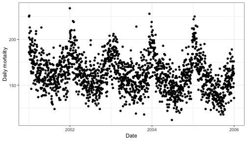
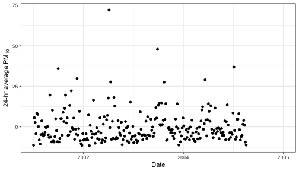
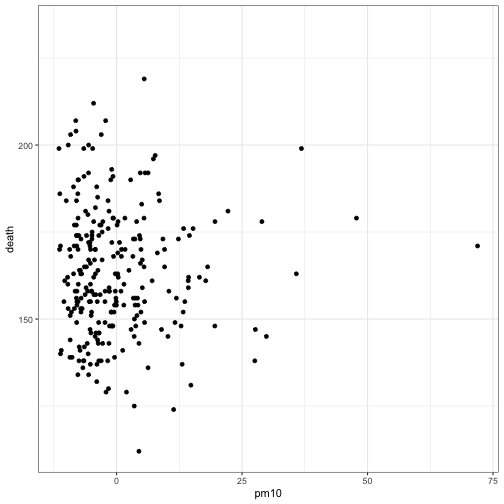
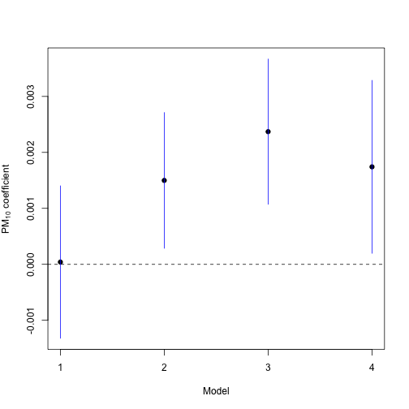
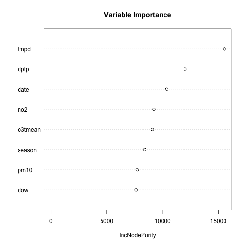

# Inference vs. Prediction: Implications for Modeling Strategy

Understanding whether you're answering an inferential question versus a prediction question is an important concept because the type of question you're answering can greatly influence the modeling strategy you pursue. If you do not clearly understand which type of question you are asking, you may end up using the wrong type of modeling approach and ultimately make the wrong conclusions from your data. The purpose of this chapter is to show you what can happen when you confuse one question for another.

The key things to remember are 

1. For **inferential questions** the goal is typically to estimate an association between a predictor of interest and the outcome. There is usually only a handful of predictors of interest (or even just one), however there are typically many potential confounding variables to consider. They key goal of modeling is to estimate an association while making sure you appropriately adjust for any potential confounders. Often, sensitivity analyses are conducted to see if associations of interest are robust to different sets of confounders.

2. For **prediction questions** the goal is to identify a model that *best predicts* the outcome. Typically we do not place any *a priori* importance on the predictors, so long as they are good at predicting the outcome. There is no notion of "confounder" or "predictors of interest" because all predictors are potentially useful for predicting the outcome. Also, we often do not care about "how the model works" or telling a detailed story about the predictors. The key goal is to develop a model with good prediction skill and to estimate a reasonable error rate from the data. 

## Air Pollution and Mortality in New York City

The following example shows how different types of questions and corresponding modeling approaches can lead to different conclusions. The example uses air pollution and mortality data for New York City. The data were originally used as part of the [National Morbidity, Mortality, and Air Pollution Study](http://www.ihapss.jhsph.edu) (NMMAPS).

Below is a plot of the daily mortality from all causes for the years 2001--2005.

And here is a plot of 24-hour average levels of particulate matter with aerodynamic diameter less than or equal to 10 microns (PM10). 

Note that there are many fewer points on the plot above than there were on the plot of the mortality data. This is because PM10 is not measured everyday. Also note that there are negative values in the PM10 plot--this is because the PM10 data were mean-subtracted. In general, negative values of PM10 are not possible.

## Inferring an Association

The first approach we will take will be to ask, "Is there an association between daily 24-hour average PM10 levels and daily mortality?" This is an inferential question and we are attempting to estimate an association. In addition, for this question, we know there are a number of potential confounders that we will have to deal with.

Let's take a look at the bivariate association between PM10 and mortality. Here is a scatterplot of the two variables.

There doesn't appear to be much going on there, and a simple linear regression model of the log of daily mortality and PM10 seems to confirm that.

|            | Estimate| Std. Error|    t value| Pr(>&#124;t&#124;)|
|:-----------|--------:|----------:|----------:|------------------:|
|(Intercept) | 5.088843|   0.006935| 733.751382|           0.000000|
|pm10tmean   | 0.000040|   0.000691|   0.058338|           0.953525|

In the table of coefficients above, the coefficient for `pm10tmean` is quite small and its standard error is relatively large. Effectively, this estimate of the association is zero.

However, we know quite a bit about both PM10 and daily mortality, and one thing we do know is that *season* plays a large role in both variables. In particular, we know that mortality tends to be higher in the winter and lower in the summer. PM10 tends to show the reverse pattern, being higher in the summer and lower in the winter. Because season is related to *both* PM10 and mortality, it is a good candidate for a confounder and it would make sense to adjust for it in the model.

Here are the results for a second model, which includes both PM10 and season. Season is included as an indicator variable with 4 levels.

|            | Estimate| Std. Error|  t value| Pr(>&#124;t&#124;)|
|:-----------|--------:|----------:|--------:|------------------:|
|(Intercept) |   5.1665|     0.0113| 458.7149|             0.0000|
|seasonQ2    |  -0.1093|     0.0167|  -6.5470|             0.0000|
|seasonQ3    |  -0.1555|     0.0170|  -9.1618|             0.0000|
|seasonQ4    |  -0.0603|     0.0167|  -3.6077|             0.0004|
|pm10tmean   |   0.0015|     0.0006|   2.4348|             0.0156|

Notice now that the `pm10tmean` coefficient is quite a bit larger than before and its `t value` is large, suggesting a strong association. How is this possible?

It turns out that we have a classic example of [Simpson's Paradox](https://en.wikipedia.org/wiki/Simpson%27s_paradox) here. The overall relationship between P10 and mortality is null, but when we account for the seasonal variation in both mortality and PM10, the association is positive. The surprising result comes from the opposite ways in which season is related to mortality and PM10.

So far we have accounted for season, but there are other potential confounders. In particular, weather variables, such as temperature and dew point temperature, are also both related to PM10 formation and mortality. 

In the following model we include temperature (`tmpd`) and dew point temperature (`dptp`). We also include the `date` variable in case there are any long-term trends that need to be accounted for.

|            | Estimate| Std. Error| t value| Pr(>&#124;t&#124;)|
|:-----------|--------:|----------:|-------:|------------------:|
|(Intercept) |   5.6207|     0.1647| 34.1242|             0.0000|
|date        |   0.0000|     0.0000| -2.2690|             0.0241|
|seasonQ2    |  -0.0581|     0.0230| -2.5250|             0.0122|
|seasonQ3    |  -0.0766|     0.0290| -2.6361|             0.0089|
|seasonQ4    |  -0.0315|     0.0183| -1.7213|             0.0864|
|tmpd        |  -0.0030|     0.0013| -2.2970|             0.0224|
|dptp        |   0.0007|     0.0010|  0.6604|             0.5096|
|pm10tmean   |   0.0024|     0.0007|  3.5995|             0.0004|

Notice that the `pm10tmean` coefficient is even bigger than it was in the previous model. There appears to still be an association between PM10 and mortality. The effect size is small, but we will discuss that later.

Finally, another class of potential confounders includes other pollutants. Before we place blame on PM10 as a harmful pollutant, it's important that we examine whether there might be another pollutant that can explain what we're observing. NO2 is a good candidate because it shares some of the same sources as PM10 and is known to be related to mortality. Let's see what happens when we include that in the model.

|            | Estimate| Std. Error| t value| Pr(>&#124;t&#124;)|
|:-----------|--------:|----------:|-------:|------------------:|
|(Intercept) |   5.6138|     0.1644| 34.1465|             0.0000|
|date        |   0.0000|     0.0000| -2.2660|             0.0243|
|seasonQ2    |  -0.0514|     0.0234| -2.2001|             0.0287|
|seasonQ3    |  -0.0657|     0.0299| -2.1967|             0.0290|
|seasonQ4    |  -0.0275|     0.0185| -1.4874|             0.1382|
|tmpd        |  -0.0030|     0.0013| -2.3092|             0.0217|
|dptp        |   0.0007|     0.0010|  0.6809|             0.4966|
|no2tmean    |   0.0013|     0.0009|  1.4677|             0.1434|
|pm10tmean   |   0.0017|     0.0008|  2.2209|             0.0273|

Notice in the table of coefficients that the `no2tmean` coefficient is similar in magnitude to the `pm10tmean` coefficient, although its `t value` is not as large. The `pm10tmean` coefficient appears to be statistically significant, but it is somewhat smaller in magnitude now.

Below is a plot of the PM10 coefficient from all four of the models that we tried.

With the exception of Model 1, which did not account for any potential confounders, there appears to be a positive association between PM10 and mortality across Models 2--4. What this means and what we should do about it depends on what our ultimate goal is and we do not discuss that in detail here. It's notable that the effect size is generally small, especially compared to some of the other predictors in the model. However, it's also worth noting that presumably, everyone in New York City breathes, and so a small effect could have a large impact.

## Predicting the Outcome

Another strategy we could have taken is to ask, "What best predicts mortality in New York City?" This is clearly a prediction question and we can use the data on hand to build a model. Here, we will use the [random forests](https://en.wikipedia.org/wiki/Random_forest) modeling strategy, which is a machine learning approach that performs well when there are a large number of predictors. One type of output we can obtain from the random forest procedure is a measure of *variable importance*. Roughly speaking, this measure indicates how important a given variable is to improving the prediction skill of the model. 

Below is a variable importance plot, which is obtained after fitting a random forest model. Larger values on the x-axis indicate greater importance.

Notice that the variable `pm10tmean` comes near the bottom of the list in terms of importance. That is because it does not contribute much to predicting the outcome, mortality. Recall in the previous section that the effect size appeared to be small, meaning that it didn't really explain much variability in mortality. Predictors like temperature and dew point temperature are more useful as predictors of daily mortality. Even NO2 is a better predictor than PM10.

However, just because PM10 is not a strong predictor of mortality doesn't mean that it does not have a relevant association with mortality. Given the tradeoffs that have to be made when developing a prediction model, PM10 is not high on the list of predictors that we would include--we simply cannot include every predictor.

## Frequently Asked Questions

## Summary

In any data analysis, you want to ask yourself "Am I asking an inferential question or a prediction question?" This should be cleared up *before* any data are analyzed, as the answer to the question can guide the entire modeling strategy. In the example here, if we had decided on a prediction approach, we might have erroneously thought that PM10 was not relevant to mortality. However, the inferential approach suggested a statistically significant association with mortality. Framing the question right, and applying the appropriate modeling strategy, can play a large role in the kinds of conclusions you draw from the data.
